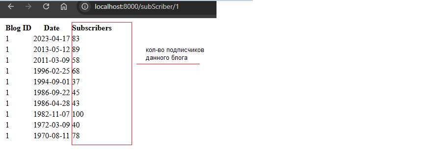
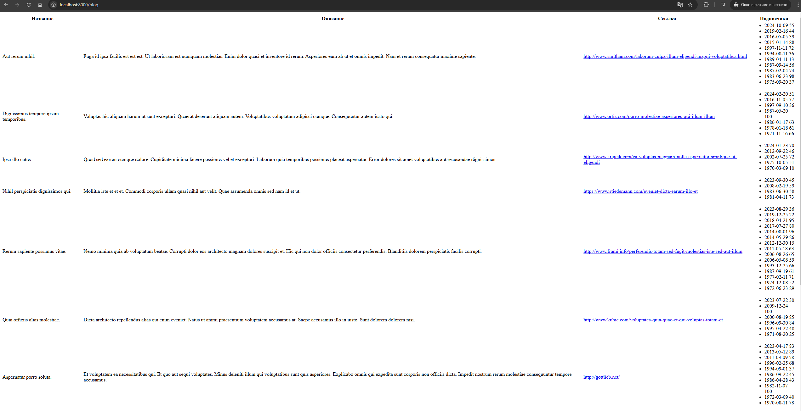

### Порядок запуска

    1. `git clone https://github.com/vladislavpetrov4311/MyResponceInLaravel.git`
    2. `cd MyResponceInLaravel\docker; docker-compose up`
    3. `php artisan migrate`
    4. `php artisan db:seed`
    5. `php artisan serve`

Переходим по url, например, к первому блогу 

1. `localhost:8000/subScriber/1`

Содержимое страницы: 

Переходим по url ко всем блогам главной страницы

2. `localhost:8000/blog`

Содержимое страницы

